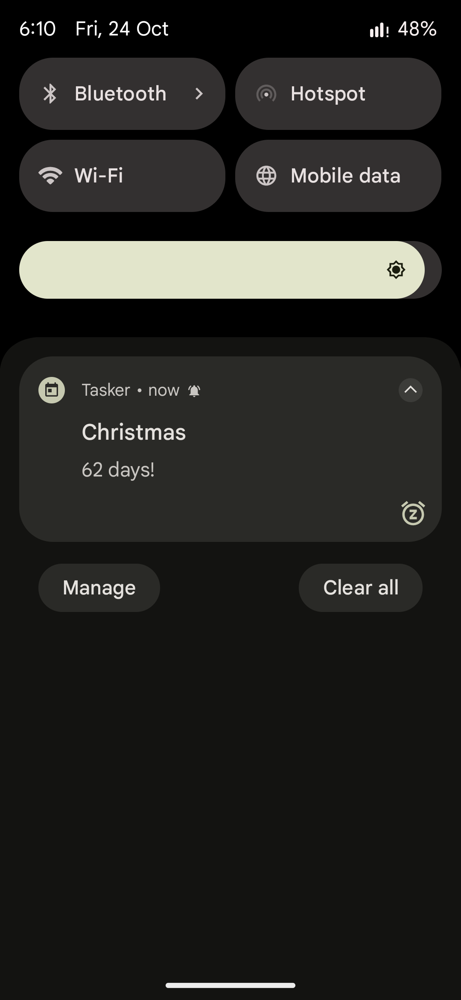
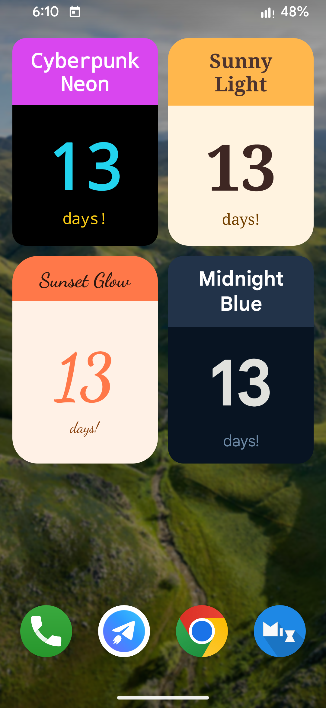
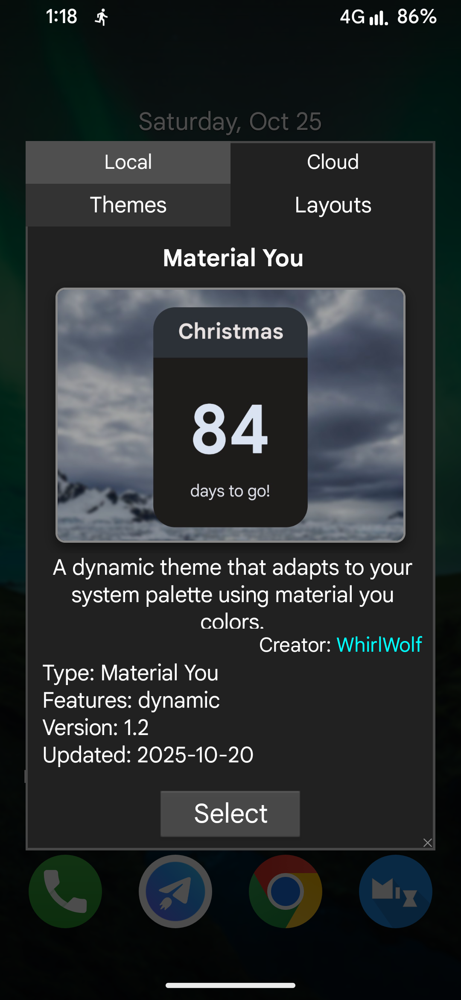
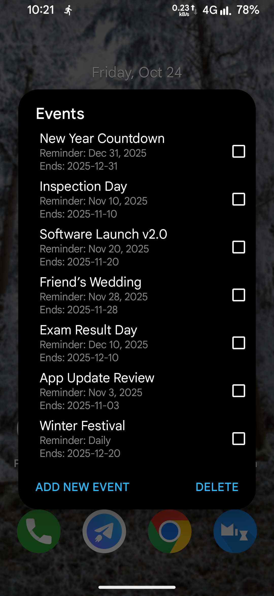

  

# Days Tracker
A tasker project to track important days, events, or milestones with stylish widgets and timely reminders!

Released: August 15, 2022

    

---

## 📲 Get Started
1. Install tasker from the Google Play Store.  
2. Click the **Import Taskernet** badge above.  
3. Follow the setup instructions.  

> 💡 Tip: Exclude tasker from battery optimizations.

## ✨ Features
* **Custom Event Tracking** – Track birthdays, anniversaries, exams, launches, or any important day.
* **Widgets** – Multiple layouts and themes for a personalized homescreen.
* **Countdown & Progress** – See days left or days passed at a glance.
* **Reminders & Alerts** – Get timely notifications for upcoming events.

## 📸 Screenshots

<table width="100%">
  <tr>
    <td align="center" valign="top">
       Notification Alert
    </td>
    <td align="center" valign="top">
       Themes
    </td>
    <td align="center" valign="top">
       Theme/Layout Selection
    </td>
    <td align="center" valign="top">
       Manage Events
    </td>
  </tr>
</table>

## ❓ FAQ
#### Why is my widget not updating?
Make sure tasker has permission to run in the background and is excluded from battery optimizations.

## 📝 Acknowledgements
* [Mr_G0OD](https://t.me/android_automation_group)

## 🤝 Contributing
Found a bug or have a feature request?
[Open an issue](https://github.com/WhirlWolf/Days-Tracker/issues)

---

